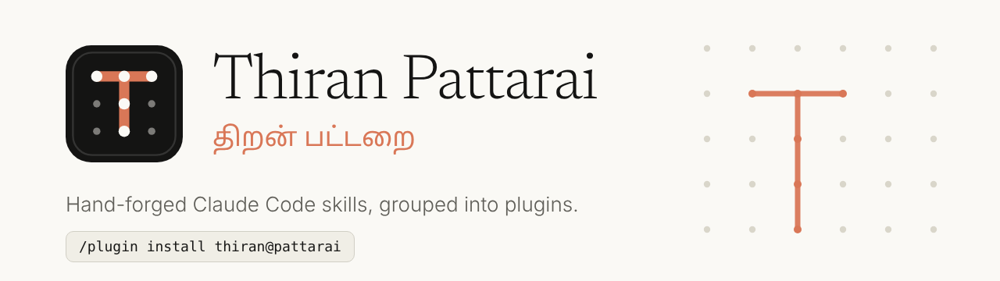

<picture>
  <source media="(prefers-color-scheme: dark)" srcset="brand/banner-dark.png">
  
</picture>

*Thiran* is Tamil for **skill**; a *pattarai* is a **workshop**. This repository is a Claude Code plugin marketplace, a growing workshop of hand-forged skills, grouped into plugins.

**Docs:** https://gmbalaa14.github.io/thiran-pattarai

## Install

```text
/plugin marketplace add gmbalaa14/thiran-pattarai
/plugin install thiran@pattarai
```

`pattarai` is the marketplace name and `thiran` is the plugin. Skills run as `/thiran:<skill>`.

## Plugins

### `thiran` — developer workflow

| Command | What it does |
| --- | --- |
| `/thiran:plan-with-me` | Turns a feature idea into a plan, flow diagrams and a summary |
| `/thiran:commit-msg` | Conventional commit messages and PR descriptions from staged changes |
| `/thiran:safe-rebase` | Rehearses a rebase on a throwaway branch before touching real history |
| `/thiran:pr-triage` | Builds an HTML report of CodeRabbit and reviewer comments from an Azure DevOps PR |
| `/thiran:pr-judge` | Judges a review comment and returns a fix, a rebuttal, or both |

More plugins (for example `thiran-devops`) will join the same marketplace and install as `<name>@pattarai`.

## Repository layout

```
.claude-plugin/marketplace.json   marketplace catalogue (name: pattarai)
plugins/<plugin>/                 one folder per plugin
  .claude-plugin/plugin.json
  skills/<skill>/SKILL.md
docs/                             Astro documentation site (light and dark)
scripts/validate.py               manifest and skill checks used in CI
brand/                            logos (light/dark), favicon, README banners, GitHub avatar and social preview
  options/                        design archive: alternative logo concepts
```

The docs site discovers plugins and skills from the manifests and `SKILL.md` files, so adding either needs no navigation edits. See [Contributing](https://gmbalaa14.github.io/thiran-pattarai/contributing/).

## Develop

```bash
python3 scripts/validate.py       # check manifests and skills
cd docs && npm install && npm run dev
```

Enable GitHub Pages with **Settings → Pages → Source: GitHub Actions**.

Set the repository image under **Settings → General → Social preview** by uploading `brand/social-preview.png`. For the organisation or account avatar, use `brand/avatar.png`.

## License

[MIT](LICENSE) © 2026 Balagurunathan Marimuthu
