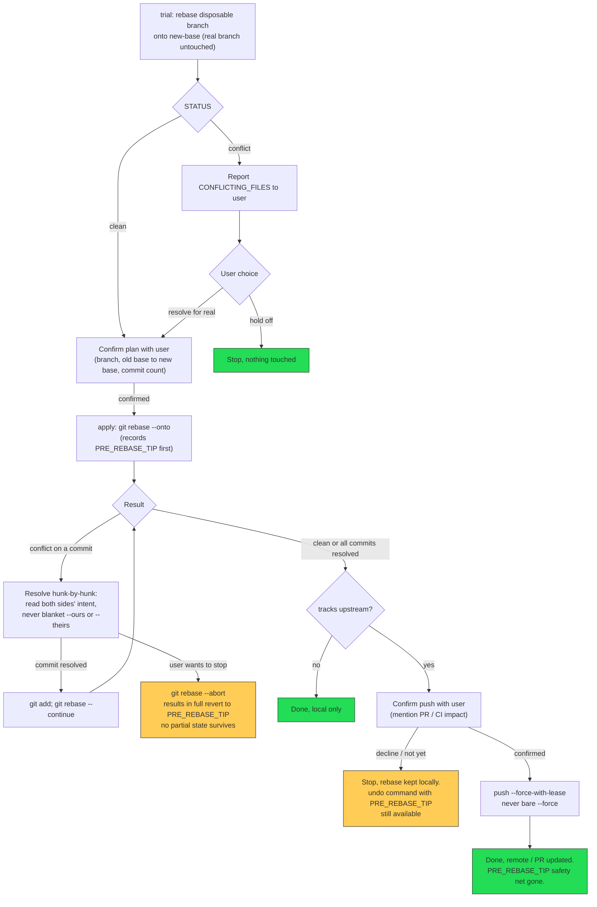

# Safe Rebase — Workflow Diagram (Mermaid)

Reference copy of the workflow described in `SKILL.md`'s "Workflow at a glance" section, in Mermaid form for rendering (GitHub, most Markdown previewers, mermaid.live, etc.). `SKILL.md` uses a plain nested list instead of a diagram there — it's the one actually loaded into context when the skill triggers, and stays readable at any width. Read this file only when a rendered picture is more useful, e.g. sharing it with someone else or checking the full shape of the flow at a glance.

## Key invariants this diagram encodes

- **Every terminal node is either "matches what the user asked for" or "back at the exact commit they started from"** — never a state the user didn't choose to be in.
- **`J` (mid-rebase abort) and `N` → `undo` (post-apply, pre-push revert) are different mechanisms for different moments** — see the "Backing out" section in `SKILL.md` for why they aren't interchangeable. There is no path in this diagram that partially reverts a rebase; abort is always a full revert to `PRE_REBASE_TIP`, regardless of how many commits already replayed cleanly in that attempt.
- **The safety net (`undo`) disappears at `O`** — pushing is the actual point of no return in this workflow, not the local rebase itself.
